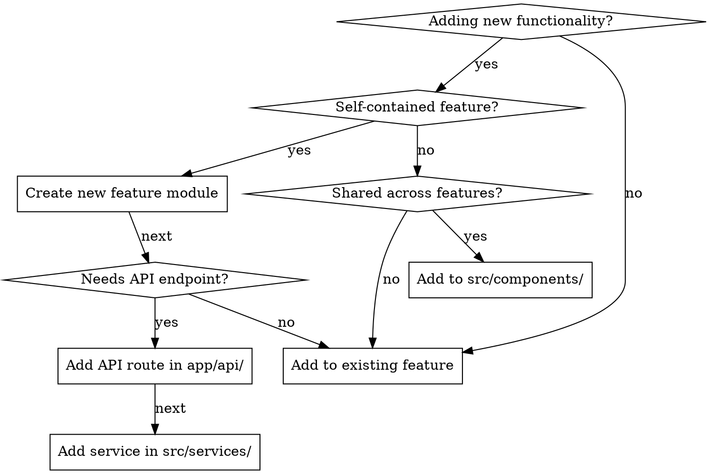

# When to Use

**Use for:**
- Next.js 16+ App Router applications with complex state management
- Web3 dApps with wallet connections and smart contract interactions
- NFT marketplaces requiring IPFS storage and blockchain transactions
- AI-integrated apps with chatbots or LLM APIs (Groq, OpenAI)
- Multi-domain projects with distinct features (dashboard, marketplace, game)
- Fullstack apps needing clear UI/backend separation

**Don't use for:**
- Simple static sites or single-page apps
- Projects using Next.js Pages Router (different patterns)
- Rapid prototypes where speed > maintainability

---

# Architecture Overview

**Frontend** code groups by **feature/domain** in `src/features/*`.
**Backend** logic groups by **service layer** in `src/services/*`.
**API routes** are thin handlers in `src/app/api/*` that delegate to services.

Key patterns:
- Feature modules are self-contained (components, hooks, types)
- Services handle external API calls (Pinata, Groq, blockchain)
- Zod validation on all inputs
- TanStack Query for server state
- Wagmi + Reown AppKit for Web3

---

# Tech Stack

| Layer | Technology | Purpose |
|-------|------------|---------|
| Framework | Next.js 16+ (App Router) | Routing, SSR, API routes |
| Language | TypeScript | Type safety |
| Styling | Tailwind CSS v4 + shadcn/ui | Utility-first + components |
| State | TanStack React Query v5 | Server state, caching |
| Validation | Zod v4 | Schema validation |
| Web3 | wagmi v2 + viem v2 + Reown AppKit | Wallet, contracts |
| Animation | Framer Motion / GSAP | UI animations |

---

# Quick Reference

| Layer | Location | Responsibility | Link to Details |
|-------|----------|----------------|-----------------|
| **Features** | `src/features/<feature>/` | Self-contained UI modules | [See details](references/knowledge.md#features-layer) |
| **Services** | `src/services/` | Business logic, external APIs | [See details](references/knowledge.md#services-layer) |
| **API Routes** | `src/app/api/` | Thin HTTP handlers | [See details](references/knowledge.md#api-layer) |
| **Components** | `src/components/` | Shared UI components | [See details](references/knowledge.md#components-layer) |

---

# Decision Flowchart

---

# Workflow for New Features

1. **Create feature folder** → `src/features/<feature-name>/`
2. **Define types** → `types.ts` ([template](assets/scripts/types-template.ts))
3. **Build UI components** → `components/` ([template](assets/scripts/component-template.tsx))
4. **Create feature hooks** → `hooks/` ([template](assets/scripts/hook-template.ts))
5. **Add API route** (if needed) → `src/app/api/<feature>/route.ts` ([template](assets/scripts/api-route-template.ts))
6. **Implement service** (if needed) → `src/services/<feature>-service.ts` ([template](assets/scripts/service-template.ts))
7. **Add Zod schemas** (if needed) → `src/lib/validation/` ([template](assets/scripts/validation-template.ts))
8. **Create page** (if page-level) → `src/app/<route>/page.tsx`

---

# Common Mistakes

| Mistake | Fix | Details |
|---------|-----|---------|
| Business logic in API routes | Move to `services/` layer | [See pattern](references/knowledge.md#api-layer) |
| Components importing across features | Extract to `components/` | [See rules](references/knowledge.md#features-layer) |
| All hooks in `src/hook/` | Feature-specific hooks go in `features/*/hooks/` | [See structure](references/knowledge.md#project-structure) |
| Using `useEffect` for server state | Use TanStack Query with caching | [See pattern](references/knowledge.md#contract-interaction-hook) |
| No Zod validation on API inputs | Always validate with schemas | [See example](references/knowledge.md#validation-schema) |
| Exposing server keys to client | Never use `NEXT_PUBLIC_` prefix for server vars | [See rules](references/knowledge.md#environment-variables) |
| Features importing each other | Keep independent; shared logic to `lib/` or `services/` | [See rules](references/knowledge.md#features-layer) |
| Importing `server/*` in client code | Services are server-only; use API routes | [See pattern](references/knowledge.md#services-layer) |

---

# Resources

**Full documentation:** [references/knowledge.md](references/knowledge.md)

**Code templates:** [assets/scripts/](assets/scripts/)

**External docs:**
- Next.js App Router: https://nextjs.org/docs/app
- Feature-Sliced Design: https://feature-sliced.design/
- TanStack Query: https://tanstack.com/query/latest
- wagmi: https://wagmi.sh/
- shadcn/ui: https://ui.shadcn.com/
- Reown AppKit: https://reown.com/appkit
